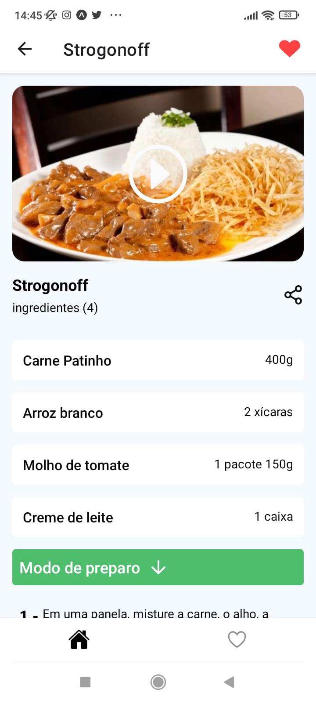
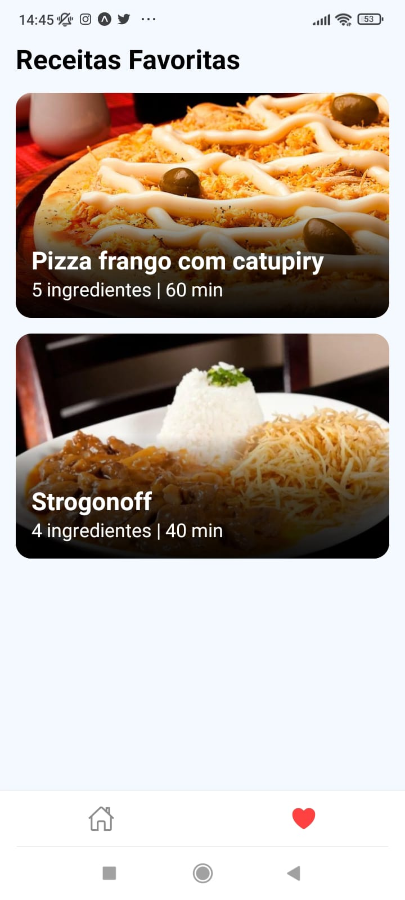

# ReceitasApp

<h1 align="center" >
    
</h1>

<h4 align="center"> 
	Receitas App 
</h4>

<p align="center">
 <a href="#-sobre-o-projeto">Sobre</a> •
 <a href="#-funcionalidades">Funcionalidades</a> •
 <a href="#-layout">Layout</a> • 
 <a href="#-como-executar-o-projeto">Como executar</a> • 
 <a href="#-tecnologias">Tecnologias</a> • 
 <a href="#-autor">Autor</a> • 
</p>

---

## 💻 Sobre o projeto

O ReceitasApp é um aplicativo que tem como objetivo mostrar uma variedade de receitas de diferentes tipos, além de exibir detalhes de preparo e vídeos do Youtube que demonstram como preparar o prato. Além disso, os usuários podem favoritar as receitas que mais gostaram. 

Este projeto foi desenvolvido durante a maratona do Sujeito Programador e posteriormente foi adicionado o TypeScript para torná-lo mais completo.

---

## 💻 Funcionalidades
 
- [x] Os usuários tem acesso ao aplicativo móvel, onde podem:
  - [x] Navegar pela lista de receitas
  - [x] Ver detalhes das receitas 
  - [x] Ver um vídeo mostrando como preparar a receita 
  - [x] Favoritar as melhores receitas
  - [x] Navegar pela lista de receitas favoritas 
  - [x] Pesquisar por receitas

---

## 💻 Layout

<p align="center">
  
  
  
  
</p>

---

## 🚀 Como executar

### Pré-requisitos

Antes de começar, você vai precisar ter instalado em sua máquina as seguintes ferramentas:
[Git](https://git-scm.com), [Node.js](https://nodejs.org/en/). 

Além disto é bom ter um editor para trabalhar com o código como [VSCode](https://code.visualstudio.com/)

```bash

# Clone este repositório
$ git clone https://github.com/WendelSantosNunes/Receitas_Mobile.git

# Instale as dependências
$ npm install

## ou

$ yarn install

# Execute o servidor (x é ip4 da sua máquina)
$ json-server --watch -d 180 --host xxxx db.json

# Execute a aplicação
$ yarn start

```

---

## 🛠 Tecnologias

#### **Mobile**  ([React Native](http://www.reactnative.com/)  +  [TypeScript](https://www.typescriptlang.org/))

-   **[Expo](https://expo.io/)**
-   **[React Navigation](https://reactnavigation.org/)**
-   **[JSON Server](https://github.com/typicode/json-server)**
-   **[Axios](https://github.com/axios/axios)**
-   **[Expo LinearGradient](https://docs.expo.dev/versions/latest/sdk/linear-gradient/)**
-   **[WebView](https://docs.expo.dev/versions/latest/sdk/webview/)**
-   **[Async Storage](https://react-native-async-storage.github.io/async-storage/docs/install/)**
-   **[Moti](https://moti.fyi/)**
-   **[Animation](https://docs.expo.dev/develop/user-interface/animation/)**
-   **[GestureHandler](https://docs.expo.dev/versions/latest/sdk/gesture-handler/#usage)**